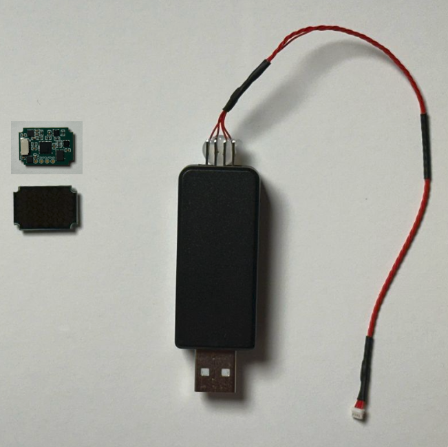
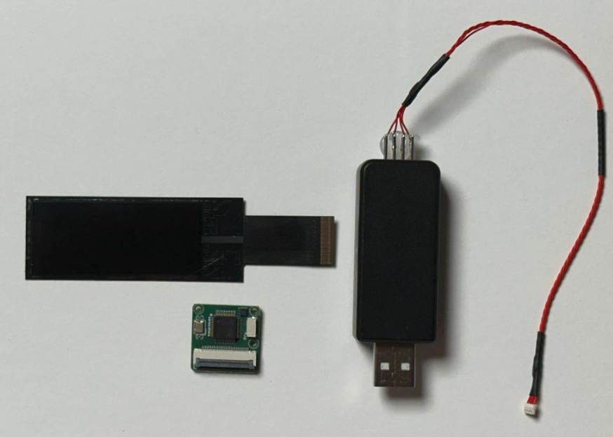
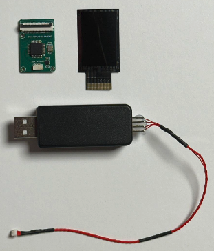

# SensX Python API

Python driver for TouchTronix tactile sensors.

## Install

```bash
cd sensx_python
pip install --upgrade pip setuptools wheel
pip install -e .
```

### Serial Permissions (Linux)

```bash
sudo chmod a+rw /dev/ttyUSB0
```

### Run Example

```bash
# Print sensor grid (default: 5x5)
python examples/stream_example.py

# Specify sensor size
python examples/stream_example.py --rows 20 --cols 8

# Measure frame rate
python examples/stream_example.py --benchmark

# All options
python examples/stream_example.py --port /dev/ttyUSB0 --baud 921600 --rows 5 --cols 5
```

### Supported Sensors

| Model     | Grid  | Image | Example Command |
|-----------|-------|-------|-----------------|
| SensX 25  | 5x5   |  | `python examples/stream_example.py --port /dev/ttyUSB0 --baud 921600 --rows 5 --cols 5` |
| SensX 160 | 20x8  |  | `python examples/stream_example.py --port /dev/ttyUSB0 --baud 921600 --rows 20 --cols 8` |
| SensX 192 | 16x12 |  | `python examples/stream_example.py --port /dev/ttyUSB0 --baud 1500000 --rows 16 --cols 12` |


## Quick Start

Blocking read:

```python
from sensx import SensX

sensor = SensX(port="/dev/ttyUSB0")
while True:
    frame = sensor.read_frame()
    print(frame)
```

Callback:

```python
from sensx import SensX

sensor = SensX(port="/dev/ttyUSB0")
sensor.on_frame = lambda frame, ts: print(frame.max())
sensor.start()
```

Callback with context manager:

```python
from sensx import SensX
import time

with SensX(port="/dev/ttyUSB0") as sensor:
    sensor.on_frame = lambda frame, ts: print(frame.max())
    sensor.start()
    time.sleep(5)
```

## API

### `SensX(port, baud_rate=15_000_000, rows=16, cols=12)`

| Method / Property     | Description                                      |
|-----------------------|--------------------------------------------------|
| `start()`             | Start background reader thread                   |
| `stop()`              | Stop the reader thread                           |
| `close()`             | Stop and close the serial port                   |
| `read_frame()`        | Blocking read -- returns one frame (no threading)|
| `latest_frame`        | Thread-safe copy of the most recent frame        |
| `latest_timestamp`    | `time.perf_counter()` of the most recent frame   |
| `on_frame`            | Callback: `fn(frame: np.ndarray, ts: float)`     |


When testing on windows OS, in the case of Frequency drop:
1. Open device manager.
2. Navigate to the Ports and select the device, right click and open properties.


3. go to advanced under the Port Settings.
4. Change the Latency Timer (msec) to 1 and click OK.


